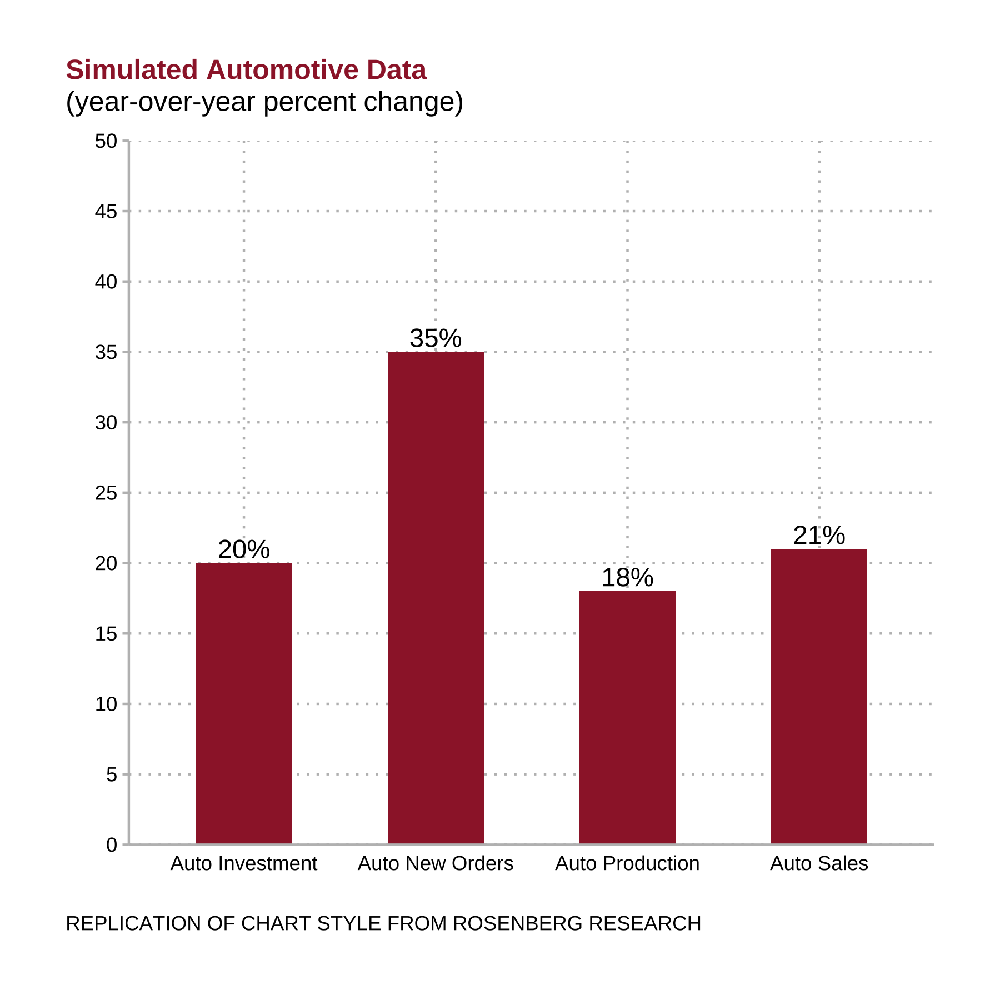
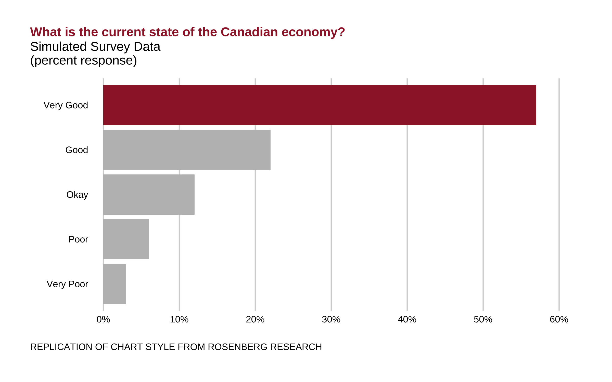
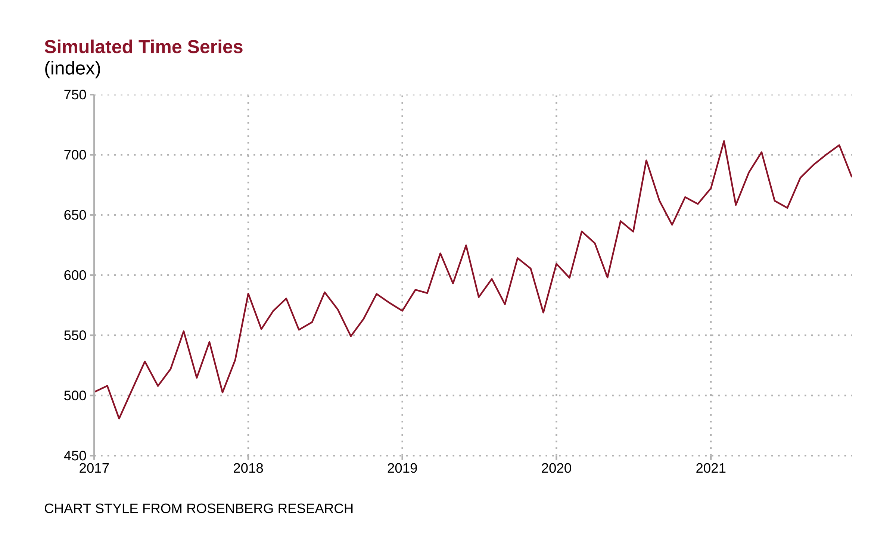
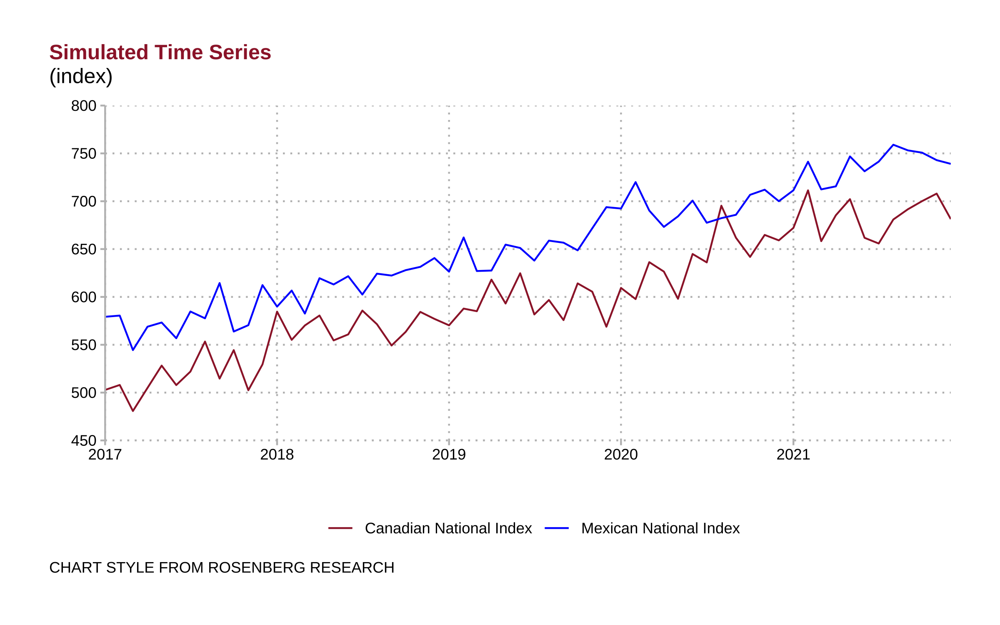
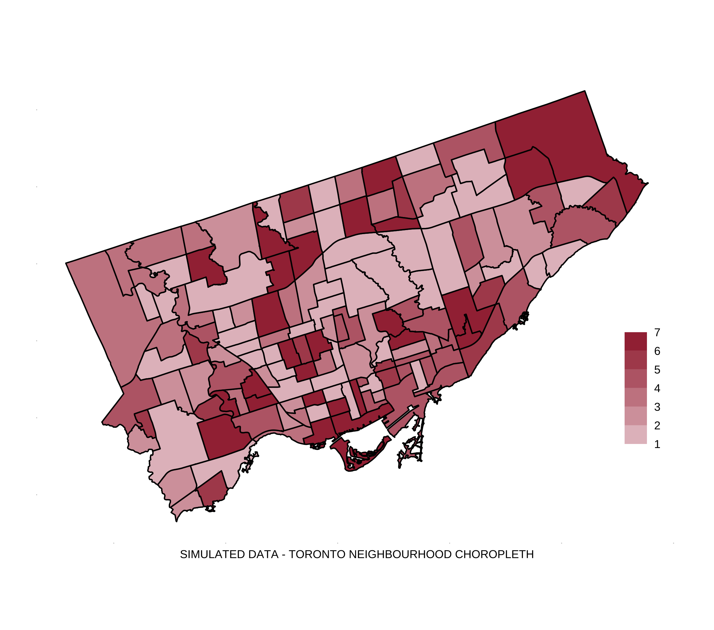

## Rosenberg Research Style Replication
Below are some brief replications of the chart styles used by Rosenberg Research & Associates, a Toronto based Marco-Economic and Market research firm. All data in these replications are simulated and the code to reproduce these chart replications can be found in `scripts/rosen_replication.R`.

#### Bar Charts

  
   

#### Line Charts

  
   

#### Choropleth

  

## File Structure
Folder `scripts` contains all code and folder `outputs` contains all finished graphs/tables/paper/and more.
